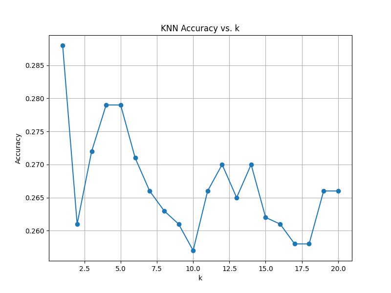

# TD 1 : Image Classification

## Prepare the CIFAR dataset

Two functions are available in the `read_cifar.py` file:

- **`read_cifar()`**: Returns all data available in the different batches.
- **`read_cifar_test()`**: Returns only the data from the `batch_test`, which is useful for testing our code.

## k-NN Classification

This project implements a k-Nearest Neighbors (k-NN) classifier using matrix operations to compute Euclidean distances between the training and testing sets. The k-NN algorithm is evaluated for various values of k, and the accuracy is plotted.

The plot `knn.png` shows the variation of the classification accuracy as a function of the number of neighbors `k`, ranging from 1 to 20. As k increases, the accuracy typically stabilizes or decreases after a certain point, depending on the dataset.

## Artificial Neural Network

### 2. Derivative of the cost with respect to $ A^{(2)} $

The derivative of the cost function $ C $ with respect to the output vector $ A^{(2)} $ is given by:

$$
\frac{\partial C}{\partial A^{(2)}} = \frac{2}{N_{out}} \sum_{i=1}^{N_{out}} (\hat{y}_i - y_i)
$$

where $ N_{out} $ is the number of output units, $ \hat{y}_i $ is the predicted output, and $ y_i $ is the desired target.

---

### 3. Derivative of the cost with respect to $ Z^{(2)} $

Using the chain rule, the derivative of the cost with respect to the pre-activation output $ Z^{(2)} $ is:

$$
\frac{\partial C}{\partial Z^{(2)}} = \frac{\partial C}{\partial A^{(2)}} \cdot \frac{\partial A^{(2)}}{\partial Z^{(2)}}
$$

Since $ A^{(2)} = \sigma(Z^{(2)}) $, we have:

$$
\frac{\partial A^{(2)}}{\partial Z^{(2)}} = \sigma'(Z^{(2)}) = \sigma(Z^{(2)}) \cdot (1 - \sigma(Z^{(2)}))
$$

Thus:

$$
\frac{\partial C}{\partial Z^{(2)}} = \frac{\partial C}{\partial A^{(2)}} \cdot A^{(2)} \cdot (1 - A^{(2)})
$$

---

### 4. Derivative of the cost with respect to $ W^{(2)} $

The derivative of the cost with respect to the weight matrix $ W^{(2)} $ is:

$$
\frac{\partial C}{\partial W^{(2)}} = \frac{\partial C}{\partial Z^{(2)}} \cdot \frac{\partial Z^{(2)}}{\partial W^{(2)}} = \frac{\partial C}{\partial Z^{(2)}} \cdot A^{(1)}
$$

where $ A^{(1)} $ is the activation of the first layer.

---

### 5. Derivative of the cost with respect to $ B^{(2)} $

The derivative of the cost with respect to the bias vector $ B^{(2)} $ is:

$$
\frac{\partial C}{\partial B^{(2)}} = \sum_{i=1}^{N_{out}} \frac{\partial C}{\partial Z^{(2)}}
$$

---

### 6. Derivative of the cost with respect to $ A^{(1)} $

The derivative of the cost with respect to the output of the first layer $ A^{(1)} $ is:

$$
\frac{\partial C}{\partial A^{(1)}} = \frac{\partial C}{\partial Z^{(2)}} \cdot \frac{\partial Z^{(2)}}{\partial A^{(1)}} = \frac{\partial C}{\partial Z^{(2)}} \cdot W^{(2)}
$$

where $ W^{(2)} $ is the weight matrix of the second layer.

---

### 7. Derivative of the cost with respect to $ Z^{(1)} $

The derivative of the cost with respect to the pre-activation vector $ Z^{(1)} $ is:

$$
\frac{\partial C}{\partial Z^{(1)}} = \frac{\partial C}{\partial A^{(1)}} \cdot \frac{\partial A^{(1)}}{\partial Z^{(1)}} = \frac{\partial C}{\partial A^{(1)}} \cdot A^{(1)} \cdot (1 - A^{(1)})
$$

---

### 8. Derivative of the cost with respect to $ W^{(1)} $

The derivative of the cost with respect to the weight matrix $ W^{(1)} $ is:

$$
\frac{\partial C}{\partial W^{(1)}} = \frac{\partial C}{\partial Z^{(1)}} \cdot A^{(0)}
$$

where $ A^{(0)} $ is the input to the network.

---

### 9. Derivative of the cost with respect to $ B^{(1)} $

The derivative of the cost with respect to the bias vector $ B^{(1)} $ is:

$$
\frac{\partial C}{\partial B^{(1)}} = \sum_{i=1}^{N_{in}} \frac{\partial C}{\partial Z^{(1)}}
$$

where $ N_{in} $ is the number of input units.
